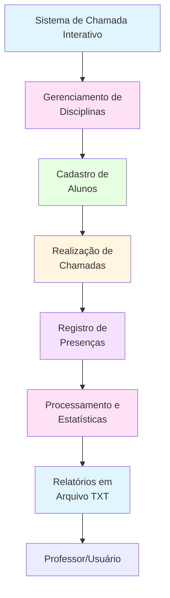

# Sistema de Chamada Interativo - Disciplina C028

## 📋 Objetivo

Desenvolver um sistema de chamada interativo que permita gerenciar múltiplas disciplinas, realizar chamadas presenciais por encontro, registrar presenças e ausências de alunos, calcular estatísticas de frequência e gerar relatórios em arquivos de texto, usando apenas os conceitos fundamentais de Python do Módulo 1.

## 🗺️ Diagrama de Contexto



## 🔧 Funcionalidades Básicas

1. **Gerenciamento de Disciplinas**
   - Criar novas disciplinas com nome e quantidade de encontros
   - Listar disciplinas cadastradas
   - Selecionar disciplina existente
   - Salvar disciplinas em arquivo texto simples

2. **Cadastro de Alunos**
   - Manter dicionário de alunos (matrícula: nome)
   - Buscar aluno por matrícula ou nome
   - Listar alunos ordenados
   - Calcular estatísticas da turma

3. **Sistema de Chamada**
   - Iniciar chamada para um encontro específico
   - Iterar sobre todos os alunos da turma
   - Registrar presença (P/p) ou ausência (Enter ou qualquer outra tecla)
   - Exibir nome e matrícula de cada aluno antes de solicitar presença
   - Mostrar progresso da chamada (ex: [1/28])

4. **Estatísticas e Relatórios**
   - Calcular total de presentes e ausentes
   - Calcular taxa de presença (%)
   - Gerar relatório formatado por encontro
   - Salvar relatórios em arquivos TXT separados por disciplina e encontro

5. **Persistência de Dados**
   - Salvar disciplinas em `data/disciplinas.txt`
   - Salvar chamadas em `data/chamada_[DISCIPLINA]_encontro_[NÚMERO].txt`
   - Carregar disciplinas existentes automaticamente

## 📊 Estrutura de Dados

### Entrada

```python
# Dicionário de alunos
alunos = {
    "2526859/8": "ANA KAROLINE DAMASCENO CAETANO",
    "2527027/4": "ANNA MARIA DO NASCIMENTO OLIVEIRA",
    # ... mais alunos
}

# Disciplina
disciplina = {
    'nome': 'Programação para Ciência de Dados',
    'num_encontros': 7,
    'chamadas': {}
}

# Resposta durante chamada
resposta = 'P'  # 'P' ou 'p' para presente, qualquer outra coisa para ausente
```

### Saída

```python
# Lista de presenças de um encontro
presencas = [
    {
        'matricula': '2526859/8',
        'nome': 'ANA KAROLINE DAMASCENO CAETANO',
        'status': 'P'  # 'P' para presente, 'F' para faltante
    },
    {
        'matricula': '2527027/4',
        'nome': 'ANNA MARIA DO NASCIMENTO OLIVEIRA',
        'status': 'F'
    },
    # ... mais alunos
]

# Estatísticas da chamada
resumo = {
    'total_alunos': 28,
    'presentes': 25,
    'ausentes': 3,
    'taxa_presenca': 89.3
}
```

## 💻 Requisitos Técnicos

- Python 3.8+
- Jupyter Notebook (opcional, pode ser executado como script Python)
- Conhecimentos em:
  - Tipos de dados (int, float, str, dict, list)
  - Estruturas de controle (if/else, for, while)
  - Funções e documentação
  - Compreensões de lista e dicionário
  - Manipulação de arquivos (leitura/escrita com `with open`)
  - Métodos de string (`isdigit()`, `upper()`, `strip()`)
  - Enumerate para iteração com índices

**Nota:** Este código usa **apenas** conceitos do Módulo 1 - Fundamentos de Python:
- **Não utiliza:** `json`, `datetime`, `os`, `threading`, `time`, `try/except`
- **Utiliza apenas:** dicionários, listas, estruturas de controle, funções, arquivos texto simples

## 📦 Entregáveis

1. **Notebook Jupyter** (`notebook_chamada.ipynb`)
   - Código completo do sistema
   - Dicionário de alunos
   - Funções de gerenciamento de disciplinas
   - Sistema de chamada interativo
   - Funções de relatórios

2. **Pasta de Dados** (`data/`)
   - `disciplinas.txt` - Armazena todas as disciplinas cadastradas
   - `chamada_[DISCIPLINA]_encontro_[NÚMERO].txt` - Relatórios de cada chamada

3. **Documentação** (`README.md`)
   - Este arquivo com instruções completas
   - Exemplos de uso

## 💡 Dicas

1. Use dicionários para armazenar alunos (`matricula: nome`)
2. Use dicionários aninhados para gerenciar disciplinas e suas informações
3. Use listas para armazenar resultados de chamadas
4. Use `list comprehension` para filtrar presentes e ausentes:
   ```python
   presentes = [p for p in presencas if p['status'] == 'P']
   ```
5. Use `enumerate()` para numerar opções e mostrar progresso
6. Use `isdigit()` para validar entradas numéricas (sem try/except)
7. Use `with open()` para garantir fechamento automático de arquivos
8. Formate números com f-strings para exibir porcentagens
9. Use multiplicação de strings para criar linhas separadoras (`"="*70`)
10. Valide entradas do usuário com estruturas condicionais explícitas

## 🏗️ Estrutura do Projeto

```
chamada/
├── notebook_chamada.ipynb          # Código principal do sistema
├── README.md                        # Este arquivo
├── alunos.jpeg                      # Imagem com lista de alunos (opcional)
└── data/                            # Pasta de dados
    ├── disciplinas.txt             # Arquivo de disciplinas cadastradas
    └── chamada_*.txt               # Relatórios de chamadas
```

## 📝 Exemplo de Uso

### 1. Executar o Sistema

```python
# No Jupyter Notebook, execute todas as células sequencialmente
# A última célula executa automaticamente menu_principal()
```

### 2. Criar Nova Disciplina

```
SISTEMA DE CHAMADA
======================================================================

📝 Nenhuma disciplina cadastrada ainda.

----------------------------------------------------------------------
NOVA DISCIPLINA
----------------------------------------------------------------------
Digite o nome da disciplina: Programação para Ciência de Dados
Digite a quantidade de encontros da disciplina: 7

✅ Disciplina 'Programação para Ciência de Dados' criada com sucesso!

Para qual encontro será a chamada? (1 a 7): 1
```

### 3. Realizar Chamada

```
======================================================================
INICIANDO CHAMADA - PROGRAMAÇÃO PARA CIÊNCIA DE DADOS
ENCONTRO: 1
======================================================================

Digite 'P' ou 'p' para PRESENTE
Digite qualquer outra coisa ou Enter para AUSENTE

----------------------------------------------------------------------

----------------------------------------------------------------------
[1/28]
ALUNO: ANA KAROLINE DAMASCENO CAETANO
MATRÍCULA: 2526859/8
----------------------------------------------------------------------
O aluno ANA KAROLINE DAMASCENO CAETANO está presente? (P/p = Presente, Enter = Ausente): P
✅ PRESENTE registrado

----------------------------------------------------------------------
[2/28]
ALUNO: ANNA MARIA DO NASCIMENTO OLIVEIRA
MATRÍCULA: 2527027/4
----------------------------------------------------------------------
O aluno ANNA MARIA DO NASCIMENTO OLIVEIRA está presente? (P/p = Presente, Enter = Ausente): 
❌ AUSENTE registrado

...

======================================================================
CHAMADA CONCLUÍDA!
======================================================================

📊 RESUMO:
Total de alunos: 28
Presentes: 25
Ausentes: 3
Taxa de presença: 89.3%

✅ Chamada salva em: data/chamada_Programacao_para_Ciencia_de_Dados_encontro_1.txt
```

### 4. Selecionar Disciplina Existente

```
SISTEMA DE CHAMADA
======================================================================

📚 DISCIPLINAS CADASTRADAS:
----------------------------------------------------------------------
1. Programação para Ciência de Dados (7 encontros)
2. Nova Disciplina
----------------------------------------------------------------------

OPÇÕES DISPONÍVEIS:
  Opção 1: Selecionar disciplina 'Programação para Ciência de Dados'
  Opção 2: Criar nova disciplina
----------------------------------------------------------------------

Escolha uma opção (1 a 2): 1

✓ Disciplina selecionada: Programação para Ciência de Dados
✓ Total de encontros: 7

Para qual encontro será a chamada? (1 a 7): 2
```

## 🔍 Funções Principais

### Funções de Disciplinas

- `carregar_disciplinas()` - Carrega disciplinas do arquivo texto
- `salvar_disciplinas(disciplinas)` - Salva disciplinas no arquivo texto
- `listar_disciplinas()` - Retorna todas as disciplinas cadastradas
- `criar_disciplina(nome, num_encontros)` - Cria uma nova disciplina

### Funções de Chamada

- `fazer_chamada(disciplina_nome, encontro, alunos_dict)` - Realiza chamada interativa
- `salvar_chamada(disciplina_nome, encontro, presencas)` - Salva resultado da chamada em arquivo

### Funções de Menu

- `menu_principal()` - Menu principal do sistema
- `criar_nova_disciplina()` - Cria nova disciplina e inicia chamada

### Funções Auxiliares (opcionais)

- `buscar_aluno_por_matricula(matricula)` - Busca aluno por matrícula
- `buscar_aluno_por_nome(nome)` - Busca aluno por nome
- `listar_alunos_ordenados()` - Lista alunos em ordem alfabética

## 📄 Formato dos Arquivos

### disciplinas.txt

```
Programação para Ciência de Dados
7
---
```

### chamada_[DISCIPLINA]_encontro_[NÚMERO].txt

```
======================================================================
CHAMADA - PROGRAMAÇÃO PARA CIÊNCIA DE DADOS
Encontro: 1
======================================================================

TOTAL DE ALUNOS: 28
PRESENTES: 25
AUSENTES: 3

----------------------------------------------------------------------
PRESENTES:
----------------------------------------------------------------------
 1. [2526859/8] ANA KAROLINE DAMASCENO CAETANO
 2. [2527291/9] ARTUR SILVA BARBOSA NUNES
...

----------------------------------------------------------------------
AUSENTES:
----------------------------------------------------------------------
 1. [2527027/4] ANNA MARIA DO NASCIMENTO OLIVEIRA
...
```

## ⚠️ Observações Importantes

1. **Execução Sequencial**: Execute as células do notebook na ordem correta
2. **Pasta data**: A pasta `data/` é criada automaticamente na primeira execução
3. **Validação de Entrada**: O sistema valida entradas usando apenas `isdigit()` e estruturas condicionais
4. **Sem Módulos Avançados**: O código não utiliza módulos além dos fundamentos de Python
5. **Arquivos de Texto**: Todos os dados são salvos em formato texto simples para facilitar leitura e manutenção

## 🎓 Disciplina

- **Disciplina**: C028 - Programação para Ciência de Dados
- **Curso**: MBA Ciência de Dados
- **Instituição**: Universidade de Fortaleza (UNIFOR)
- **Instrutor**: Cássio Pinheiro

