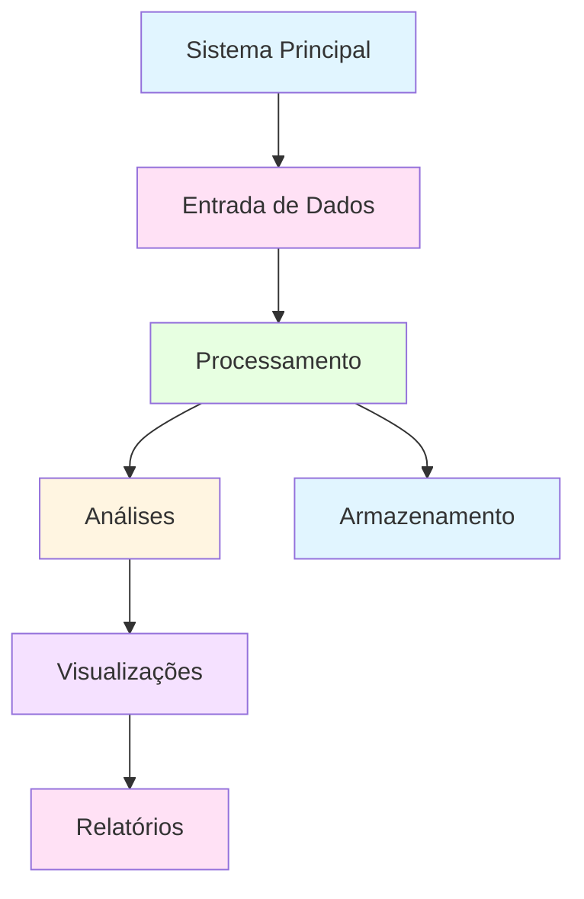

# [Nome do Projeto]

**Disciplina:** Programação para Ciência de Dados  
**Curso:** MBA Ciência de Dados - UNIFOR  
**Instrutor:** Cássio Pinheiro  
**Integrantes:** 
- Nome Completo 1 (Matrícula)
- Nome Completo 2 (Matrícula) - *opcional*
- Nome Completo 3 (Matrícula) - *opcional*

**Repositório GitHub:** [https://github.com/seu-usuario/nome-do-repositorio](https://github.com/seu-usuario/nome-do-repositorio)  
**Data de Entrega:** 14/11/2024

---

## 🎯 Objetivo do Projeto

[Descreva aqui o propósito do projeto, qual problema ele resolve e em que contexto será utilizado. Seja claro e objetivo.]

**Exemplo:**
Este projeto visa desenvolver um sistema de análise de vendas para uma loja de eletrônicos, permitindo identificar padrões de consumo, produtos mais vendidos e desempenho de vendedores através de análises estatísticas e visualizações.

---

## 📊 Diagrama de Contexto

[Insira aqui um diagrama Mermaid mostrando o contexto do sistema. Use o formato abaixo como exemplo.]



---

## 🔧 Funcionalidades Implementadas

### Funcionalidades Básicas
1. **[Nome da Funcionalidade 1]**
   - Descrição do que faz
   - Módulos utilizados: Módulo 1, Módulo 2

2. **[Nome da Funcionalidade 2]**
   - Descrição do que faz
   - Módulos utilizados: Módulo 2, Módulo 3

3. **[Nome da Funcionalidade 3]**
   - Descrição do que faz
   - Módulos utilizados: Módulo 1, Módulo 3

### Funcionalidades Avançadas
1. **[Nome da Funcionalidade Avançada]**
   - Descrição detalhada
   - Módulos utilizados: Todos os módulos

---

## 📦 Estrutura de Dados

### Modelos de Entrada

[Descreva aqui as estruturas de dados de entrada. Use exemplos em Python.]

```python
# Exemplo de estrutura de entrada
dados_entrada = {
    'campo1': 'valor1',
    'campo2': 123,
    'campo3': ['lista', 'de', 'valores']
}
```

### Modelos de Saída

[Descreva aqui as estruturas de dados de saída.]

```python
# Exemplo de estrutura de saída
resultado = {
    'total': 1000.0,
    'media': 50.0,
    'detalhes': [...]
}
```

### Formatos de Arquivo

- **CSV:** Formato utilizado para dados tabulares
- **TXT:** Formato utilizado para relatórios textuais
- **JSON:** Formato utilizado para configurações (se aplicável)

---

## 💻 Requisitos Técnicos

### Versão do Python
- Python 3.8 ou superior

### Bibliotecas Necessárias

```
pandas>=1.5.0
numpy>=1.23.0
matplotlib>=3.6.0
seaborn>=0.12.0
```

### Instalação das Dependências

```bash
pip install -r requirements.txt
```

---

## 🚀 Como Executar o Projeto

### 1. Clone o Repositório
```bash
git clone https://github.com/seu-usuario/nome-do-repositorio.git
cd nome-do-repositorio
```

### 2. Instale as Dependências
```bash
pip install -r requirements.txt
```

### 3. Prepare os Dados
[Instruções sobre como preparar ou obter os dados necessários]

### 4. Execute o Programa Principal
```bash
python main.py
```

### Exemplo de Uso

```python
# Exemplo de código de uso
from sistema import Sistema

# Criar instância
sistema = Sistema()

# Carregar dados
sistema.carregar_dados('dados/arquivo.csv')

# Executar análise
resultado = sistema.analisar()

# Gerar visualizações
sistema.visualizar()
```

---

## 📈 Análises Realizadas

[Descreva as principais análises realizadas]

1. **Análise de Distribuição**
   - Descrição do que foi analisado
   - Principais descobertas

2. **Análise de Correlações**
   - Variáveis correlacionadas identificadas
   - Insights obtidos

3. **Análise Temporal** (se aplicável)
   - Tendências identificadas
   - Padrões temporais

### Visualizações Criadas

1. **Gráfico de Barras:** Comparação de categorias
2. **Histograma:** Distribuição de valores
3. **Heatmap:** Matriz de correlação
4. **Gráfico de Linha:** Evolução temporal

### Principais Insights

- Insight 1: [Descrição]
- Insight 2: [Descrição]
- Insight 3: [Descrição]

---

## 📁 Estrutura do Projeto

```
nome_projeto/
├── README.md                 # Este arquivo
├── requirements.txt          # Dependências do projeto
├── main.py                   # Arquivo principal
├── src/                      # Código fonte (opcional)
│   ├── __init__.py
│   ├── processamento.py
│   └── visualizacao.py
├── dados/                    # Arquivos de dados
│   ├── dataset.csv
│   └── dados_processados/
├── notebooks/                # Notebooks de análise (opcional)
│   └── analise_exploratoria.ipynb
├── relatorios/               # Relatórios gerados
│   └── relatorio_final.txt
└── .gitignore               # Arquivos ignorados pelo Git
```

---

## 📸 Capturas de Tela / Exemplos de Saída

### Visualização 1: [Nome do Gráfico]


### Visualização 2: [Nome do Gráfico]


### Exemplo de Saída do Programa
```
========================================
SISTEMA DE ANÁLISE
========================================
Total de registros: 1000
Média: 50.5
Desvio padrão: 12.3
========================================
```

---

## 🧪 Testes Realizados

### Cenários Testados

1. **Teste de Carga de Dados**
   - ✅ Arquivo CSV válido carregado com sucesso
   - ✅ Tratamento de arquivo inexistente
   - ✅ Validação de formato de dados

2. **Teste de Processamento**
   - ✅ Cálculos estatísticos corretos
   - ✅ Agrupamentos funcionando
   - ✅ Filtros aplicados corretamente

3. **Teste de Visualizações**
   - ✅ Gráficos gerados sem erros
   - ✅ Formatação adequada
   - ✅ Labels e títulos corretos

### Validações Implementadas

- Validação de tipos de dados
- Validação de valores nulos
- Validação de ranges de valores
- Tratamento de erros de entrada

---

## 📚 Referências e Bibliografia

### Documentação Consultada
- [Pandas Documentation](https://pandas.pydata.org/docs/)
- [Matplotlib Documentation](https://matplotlib.org/stable/contents.html)
- [Seaborn Documentation](https://seaborn.pydata.org/)

### Tutoriais Utilizados
- [Link para tutorial 1]
- [Link para tutorial 2]

### Datasets Utilizados
- [Nome do Dataset](link) - Descrição
- [Nome do Dataset](link) - Descrição

### Outras Referências
- Livros, artigos, ou outros recursos utilizados

---

## 🤝 Contribuições dos Integrantes

### Integrante 1: [Nome]
- Responsabilidades:
  - Desenvolvimento do módulo de processamento
  - Implementação das análises estatísticas
  - Criação das visualizações básicas
- Principais commits:
  - `Implementação do processamento de dados`
  - `Adição de análises estatísticas`
  - `Criação de visualizações com Matplotlib`

### Integrante 2: [Nome] - *se houver*
- Responsabilidades:
  - Desenvolvimento do módulo de visualização
  - Implementação de análises avançadas
  - Documentação do projeto
- Principais commits:
  - `Implementação de visualizações com Seaborn`
  - `Análises avançadas com Pandas`
  - `Atualização do README`

### Integrante 3: [Nome] - *se houver*
- Responsabilidades:
  - Estruturação do projeto
  - Testes e validações
  - Preparação dos dados
- Principais commits:
  - `Estruturação inicial do projeto`
  - `Implementação de testes`
  - `Preparação e limpeza de dados`

---

## 🔄 Próximos Passos / Melhorias Futuras

### Funcionalidades Planejadas
- [ ] Implementação de interface gráfica
- [ ] Adição de mais tipos de visualizações
- [ ] Exportação de relatórios em PDF
- [ ] Integração com banco de dados

### Melhorias Técnicas
- [ ] Otimização de performance
- [ ] Adição de testes automatizados
- [ ] Implementação de logging
- [ ] Refatoração de código duplicado

### Expansões do Projeto
- [ ] Suporte a múltiplos formatos de entrada
- [ ] Análises em tempo real
- [ ] Dashboard interativo
- [ ] API REST para acesso aos dados

---

## 📝 Notas Adicionais

[Qualquer informação adicional que seja relevante para o projeto]

---

**Desenvolvido como parte do Projeto Final da disciplina Programação para Ciência de Dados - MBA Ciência de Dados - UNIFOR**

