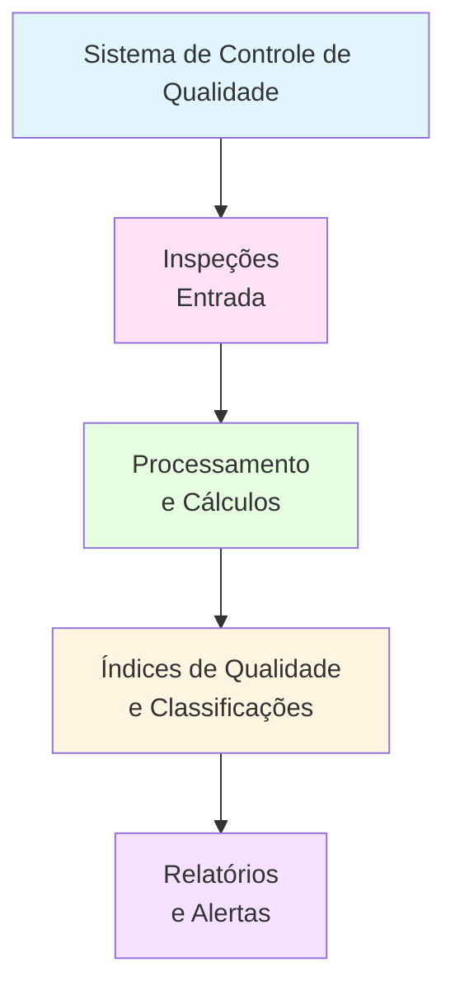

# Projeto 03: Sistema de Controle de Qualidade de Produtos

## 📋 Objetivo

Desenvolver um sistema para controle de qualidade de produtos que permita registrar inspeções, calcular índices de qualidade, identificar produtos com defeitos e gerar relatórios de conformidade.

## 🗺️ Diagrama de Contexto



## 🔧 Funcionalidades Básicas

1. **Registro de Inspeções**
   - Registrar inspeção de produto (código, tipo_defeito, severidade, data)
   - Classificar severidade (Crítico, Alto, Médio, Baixo)
   - Validar dados de entrada

2. **Cálculos de Qualidade**
   - Calcular taxa de defeitos por produto
   - Calcular taxa de conformidade geral
   - Calcular índice de qualidade (0-100)
   - Agrupar defeitos por tipo

3. **Análises**
   - Identificar produtos com mais defeitos
   - Identificar tipos de defeitos mais comuns
   - Calcular estatísticas por severidade
   - Analisar tendências temporais

4. **Classificações**
   - Classificar produtos como Aprovado/Reprovado
   - Identificar produtos críticos (> X defeitos críticos)
   - Gerar alertas para produtos com problemas

5. **Relatórios**
   - Relatório geral de qualidade
   - Relatório por produto
   - Relatório por tipo de defeito
   - Relatório de produtos reprovados

## 📊 Estrutura de Dados

### Entrada

```python
# Inspeção individual
inspecao = {
    'codigo_produto': 'PROD001',
    'tipo_defeito': 'Risco na pintura',
    'severidade': 'Médio',
    'data': '2024-01-15',
    'inspetor': 'João Silva'
}
```

### Saída

```python
# Lista de inspeções
inspecoes = [
    {
        'codigo_produto': 'PROD001',
        'tipo_defeito': 'Risco na pintura',
        'severidade': 'Médio',
        'data': '2024-01-15',
        'inspetor': 'João Silva'
    },
    # ... mais inspeções
]

# Estatísticas por produto
estatisticas_produto = {
    'PROD001': {
        'total_defeitos': 3,
        'defeitos_criticos': 0,
        'defeitos_altos': 1,
        'defeitos_medios': 2,
        'defeitos_baixos': 0,
        'indice_qualidade': 85.5,
        'status': 'Aprovado'
    }
}

# Estatísticas por tipo de defeito
defeitos_por_tipo = {
    'Risco na pintura': 15,
    'Solda irregular': 8,
    'Embalagem danificada': 5
}
```

## 💻 Requisitos Técnicos

- Python 3.8+
- Conhecimentos em:
  - Tipos de dados (int, float, str, dict, list, set)
  - Estruturas de controle (if/else, for, while)
  - Funções com parâmetros e retorno
  - Compreensões de lista e dicionário
  - Funções lambda e filter
  - Operações com conjuntos (sets)

## 📦 Entregáveis

1. **Código Python** (`sistema_qualidade.py`)
   - Módulo completo com todas as funcionalidades
   - Funções bem documentadas
   - Validações e classificações

2. **Dados de Exemplo** (`inspecoes_exemplo.txt`)
   - Arquivo com inspeções de exemplo
   - Formato estruturado

3. **Relatórios Gerados** (`relatorios/`)
   - Relatório geral
   - Relatório por produto
   - Relatório de produtos reprovados

4. **Documentação** (`README.md`)
   - Instruções de uso
   - Explicação dos índices

## 💡 Dicas

1. Use dicionários para mapear severidades a pesos:
   ```python
   pesos_severidade = {
       'Crítico': 10,
       'Alto': 5,
       'Médio': 2,
       'Baixo': 1
   }
   ```
2. Use set para identificar tipos únicos de defeitos
3. Use list comprehension para filtrar por condições
4. Use dict comprehension para agrupar dados
5. Implemente função de cálculo de índice:
   - Índice = 100 - (peso_total_defeitos / total_produtos * 100)
6. Use `filter()` para separar produtos por status
7. Use `sorted()` para ordenar produtos por índice

## 🏗️ Esqueleto do Projeto

```python
# sistema_qualidade.py

# ============================================
# Sistema de Controle de Qualidade
# ============================================

inspecoes = []
produtos = set()  # Set para armazenar códigos únicos de produtos

# Pesos de severidade
PESOS_SEVERIDADE = {
    'Crítico': 10,
    'Alto': 5,
    'Médio': 2,
    'Baixo': 1
}

LIMITE_DEFEITOS_CRITICOS = 2  # Limite para reprovação

# ============================================
# FUNÇÕES DE CADASTRO
# ============================================

def registrar_inspecao(codigo_produto, tipo_defeito, severidade, data, inspetor):
    """
    Registra uma nova inspeção.
    
    Args:
        codigo_produto (str): Código do produto
        tipo_defeito (str): Tipo de defeito encontrado
        severidade (str): Severidade do defeito
        data (str): Data da inspeção (YYYY-MM-DD)
        inspetor (str): Nome do inspetor
    
    Returns:
        dict: Inspeção registrada
    """
    # TODO: Validar severidade
    # TODO: Criar dicionário da inspeção
    # TODO: Adicionar à lista
    # TODO: Adicionar produto ao set
    pass

# ============================================
# FUNÇÕES DE CÁLCULOS
# ============================================

def calcular_defeitos_por_produto():
    """
    Calcula quantidade de defeitos por produto.
    
    Returns:
        dict: {codigo_produto: quantidade_defeitos}
    """
    # TODO: Agrupar inspeções por produto
    # TODO: Contar defeitos
    # TODO: Usar dict comprehension
    pass

def calcular_defeitos_por_severidade(codigo_produto):
    """
    Calcula defeitos agrupados por severidade para um produto.
    
    Args:
        codigo_produto (str): Código do produto
    
    Returns:
        dict: {severidade: quantidade}
    """
    # TODO: Filtrar inspeções do produto
    # TODO: Agrupar por severidade
    # TODO: Contar por tipo
    pass

def calcular_indice_qualidade(codigo_produto):
    """
    Calcula índice de qualidade de um produto (0-100).
    
    Args:
        codigo_produto (str): Código do produto
    
    Returns:
        float: Índice de qualidade
    """
    # TODO: Filtrar defeitos do produto
    # TODO: Calcular peso total
    # TODO: Aplicar fórmula do índice
    # TODO: Garantir que não seja negativo
    pass

def calcular_taxa_conformidade():
    """
    Calcula taxa de conformidade geral (% de produtos aprovados).
    
    Returns:
        float: Taxa de conformidade (0-100)
    """
    # TODO: Obter lista de produtos únicos
    # TODO: Contar produtos aprovados
    # TODO: Calcular percentual
    pass

# ============================================
# FUNÇÕES DE CLASSIFICAÇÃO
# ============================================

def classificar_produto(codigo_produto):
    """
    Classifica produto como Aprovado ou Reprovado.
    
    Args:
        codigo_produto (str): Código do produto
    
    Returns:
        str: 'Aprovado' ou 'Reprovado'
    """
    # TODO: Contar defeitos críticos
    # TODO: Verificar se excede limite
    # TODO: Retornar status
    pass

def identificar_produtos_criticos():
    """
    Identifica produtos com muitos defeitos críticos.
    
    Returns:
        list: Lista de códigos de produtos críticos
    """
    # TODO: Filtrar produtos com defeitos críticos > limite
    # TODO: Retornar lista
    pass

# ============================================
# FUNÇÕES DE ANÁLISE
# ============================================

def defeitos_mais_comuns(limite=5):
    """
    Identifica tipos de defeitos mais comuns.
    
    Args:
        limite (int): Quantidade de defeitos a retornar
    
    Returns:
        list: Lista de tuplas (tipo_defeito, quantidade)
    """
    # TODO: Contar defeitos por tipo
    # TODO: Ordenar por quantidade (decrescente)
    # TODO: Retornar top N
    pass

def produtos_com_mais_defeitos(limite=5):
    """
    Identifica produtos com mais defeitos.
    
    Args:
        limite (int): Quantidade de produtos a retornar
    
    Returns:
        list: Lista de tuplas (codigo, quantidade)
    """
    # TODO: Calcular defeitos por produto
    # TODO: Ordenar por quantidade (decrescente)
    # TODO: Retornar top N
    pass

def estatisticas_por_severidade():
    """
    Calcula estatísticas agrupadas por severidade.
    
    Returns:
        dict: {severidade: quantidade_total}
    """
    # TODO: Agrupar inspeções por severidade
    # TODO: Contar por tipo
    pass

# ============================================
# FUNÇÕES DE RELATÓRIOS
# ============================================

def gerar_relatorio_produto(codigo_produto):
    """
    Gera relatório completo de um produto.
    
    Args:
        codigo_produto (str): Código do produto
    
    Returns:
        dict: Relatório do produto
    """
    # TODO: Calcular todas as estatísticas
    # TODO: Criar dicionário de relatório
    pass

def gerar_relatorio_geral():
    """
    Gera relatório geral de qualidade.
    
    Returns:
        dict: Relatório completo
    """
    # TODO: Calcular todas as métricas
    # TODO: Criar dicionário de relatório
    pass

def exibir_relatorio():
    """
    Exibe relatório formatado no console.
    """
    # TODO: Formatar e exibir informações
    # TODO: Usar f-strings para formatação
    pass

# ============================================
# FUNÇÕES AUXILIARES
# ============================================

def validar_severidade(severidade):
    """
    Valida se a severidade é válida.
    
    Args:
        severidade (str): Severidade a validar
    
    Returns:
        bool: True se válida, False caso contrário
    """
    # TODO: Verificar se está em PESOS_SEVERIDADE
    pass

def obter_produtos_unicos():
    """
    Retorna lista de códigos únicos de produtos.
    
    Returns:
        set: Set de códigos de produtos
    """
    # TODO: Extrair códigos únicos das inspeções
    # TODO: Usar set comprehension
    pass

# ============================================
# FUNÇÃO PRINCIPAL
# ============================================

def main():
    """
    Função principal do programa.
    """
    # TODO: Menu interativo
    # TODO: Opções: registrar, relatórios, análises, sair
    pass

if __name__ == "__main__":
    main()
```

## 📝 Exemplo de Uso

```python
# Registrar inspeções
registrar_inspecao('PROD001', 'Risco na pintura', 'Médio', '2024-01-15', 'João Silva')
registrar_inspecao('PROD001', 'Solda irregular', 'Alto', '2024-01-15', 'João Silva')
registrar_inspecao('PROD002', 'Embalagem danificada', 'Baixo', '2024-01-16', 'Maria Santos')

# Gerar relatório de produto
relatorio = gerar_relatorio_produto('PROD001')
print(f"Índice de qualidade: {relatorio['indice_qualidade']:.2f}")
print(f"Status: {relatorio['status']}")

# Ver defeitos mais comuns
top_defeitos = defeitos_mais_comuns(3)
print("Top 3 Defeitos:")
for defeito, quantidade in top_defeitos:
    print(f"{defeito}: {quantidade}")
```

